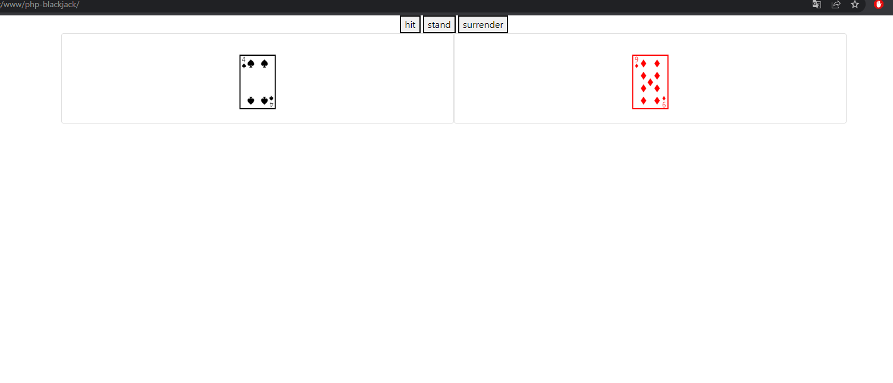

# php-blackjack
today i'm goig to try and make a php blackjack game. I suspect this is going to be defficult sinds i always have troubles using someone elses code. i will probably loose a lot of time to get what all the code already does. i'll try my best even if it fails in the end. i'll have a clearer image off OOP in return i hope...

sooo off to the task.
## important notes 
## flow:
* shuffle deck
* player ander dealer both 2 rnd cards
* first deadler card shows
* player at this stage is allowed to choose the get more cards or to stand down
* if player > 21 = loose!!!
* after the player the dealer keeps hittting until 15 points minimum after that he stands or busts
* compare card values and show winner

## instructions
### 1/ Create a class called Player in the file Player.php.
```php
    class Player {
    
    }
```
### 2/ Add 2 private properties: cards (array), lost (bool, default = false)
```php
    private array $cards = [];
    private bool $lost = false;
```

### 3/ Add a couple of empty public methods to this class:
```php
    public function hit(){

    }
    public function surrender(){

    }
    public function getScore(){

    }
    public function hasLost(){

    }
```
### 4/ Create a class called Blackjack in the file Blackjack.php
```php
class Blackjack {

}
```
### 5/ Add 3 private properties
```php
    private object $player;
    private object $dealer;
    private object $deck;
```
### 6/ Add the following public methods:
```php
    public function getPlayer(){
        return $this->player;
    }
    public function getDealer() {
        return $this->dealer;
    }
    public function getDeck() {
        return $this->deck;
    }
```
### 7/ In the constructor do the following:
```php
    public function __construct(){
        $this->player = new Player;
        $this->dealer = new Player;
        $this->deck = new Deck;
        //possible that it's $shuffledDeck = $this->deck->shuffle;
        $this->deck->shuffle();
    }
```
* new iteration
```php
    public function __construct($deck){
        $this->player = new Player;
        $this->dealer = new Dealer;
        $this->deck = $deck;
    }
```
passed deck as parameter, sinds it is already made in examples.php and also shuffled so deleted that.
* new iteration 2
```php
    public function __construct(){
        $this->deck = new Deck() ;
        $this->deck->shuffle();
        $this->player = new Player($this->deck) ;
        $this->dealer = new Dealer($this->deck) ;
    }
```
not passing anything through parameters, structure changed too, to prevent errors.
### 8/ In the constructor of the Player class;
```php
    $this->cards[] = $deck->drawCard();
    $this->cards[] = $deck->drawCard();
```
A lot of confusion started here... Its became difficult to understand what method was wich class or the other and also how to address certain things. because it is ez to say: "oh, yea pass the deck from the blackjack class" but it's hard to just write that down. from what blackjack object??? haven't declared it... Aperently it's Deck $deck just passing Deck as type is good enough and then later $blackjack->getDeck(); or smth..I also thought darwCard was private so that confused mee too. (how am i gonna draw a card from an object that doesn't possess that method to draw.. it's public so no problems).
### 9/ Go back to the Player class and add the following logic in your empty methods:
* #### getScore()
```php
    public function getScore(){
        $counter = 1;
        $factors = [];
        foreach($this->cards as $key => $value){
            $factors[$counter] = $this->cards[$key]->$value[1];
            $counter++;
        }
        $sum = $factors[0] + $factors[1];
        return $sum;

    }
```
this is my first iteration of the code... this is probably not going to work. But either way it will suffise as guidance at debugging stage;
* * after fixing the IDE error
```php
    public function getScore():int{
        $score = 0;
        foreach($this->cards as $card){
           $score += $card->getValue();
        }
        return $score;

    }
```
after creating the hit function i revised a bit again to take the cards array as a parameter
```php
    public function getScore(array $cardsArray):int{
        $score = 0;
        foreach($cardsArray as $card){
           $score += $card->getValue();
        }
        return $score;

    }
```
again this was reverted for the same reasons as stated with the other revisions you are going to see.
```php
    public function getScore():int{
        $score = 0;
        foreach($this->cards as $card){
           $score += $card->getValue();
        }
        return $score;

    }
```

* #### hasLost()
```php
    public function hasLost(): bool{
        return $this->lost;
    }
```
i think this is oke, we'll see later on
* #### hit()
```php
    public function hit(Deck $deck):void{
        $this->cards[] += $deck->drawCard();
        if(getScore($this->cards) > $this->blackJack){
            $this->lost = true;
        }
    }
```
removed the += and changed it to just = sinds that is the equivalent of array_push.
```php
    public function hit(Deck $deck):void{
        $this->cards[] = $deck->drawCard();
        if(getScore($this->cards) > $this->blackJack){
            $this->lost = true;
        }
    }
```
* #### surrender()
```php
    public function surrender(){
        $this->lost = true;
    }
```
sets lost to true

### 10/ Creating the index.php file
* #### created index.php file outside of code folder
```php
 
require ('./code/Player.php');
require ('./code/Blackjack.php');
require ('./code/Card.php');
require ('./code/Deck.php');
require ('./code/example.php');
require ('./code/Suit.php');


```
* #### just resuired them will see where to place em next. (see above)
* #### if the session does not have a Blackjack variable yet
```php
if (!$_SESSION[$blackjack]){
}
```
fi session check
* #### Put the Blackjack object in the session
```php
if (!$_SESSION[$blackjack]){
    $_SESSION[$blackjack] = new Blackjack;
}
```
placed in the session blackjack variable
============
this was changed to:
```php
session_start();
if (!isset($_SESSION['blackjack'])){
    $_SESSION['blackjack'] = new Blackjack;
}
foreach($_SESSION['blackjack']->getDeck()->getCards() AS $card) {
    echo $card->getUnicodeCharacter(true);
    echo '<br>';
}
```
as you can see i had to change it to 'blackjack', instead of $deck it is getDeck sinds it was private
* #### buttons
as of now i need more context and will ask the coaches for some help to create these buttons
```html
   <form style="text-align:center;" method="post">
        <button name="hit">hit</button>
        <button name="stand">stand</button>
        <button name="surrender">surrender</button>
   </form>
```
html added for the buttons
### 11/  the dealer 
* #### the extention
```php
class Dealer extends Player {
    
}
```
created a new Dealer.php file and wrote this code.
* #### offcourse we need to change this now in blackjack class
```php
    public function __construct(){
        $this->deck = new Deck() ;
        $this->deck->shuffle();
        $this->player = new Player($this->deck) ;
        $this->dealer = new Dealer($this->deck) ;
    }
```
* #### Now create a hit function that keeps drawing cards until the dealer has at least 15 points. The tricky part is that we also need the lost check we already had in the hit function of the player. We could just copy the code but duplicated code is never the solution, instead you can use the following code to call the old hit function:

parent::hit();
```php
    private int $treshHold = 15;

    public function hit($cardsArray,Deck $deck){
        if(getScore($cardsArray)< $this->treshHold){
            $this->cards[] = $deck->drawCard();
        }
        else{
            parent::hit();
        }
    }
```
created treshhold instead ofmagic number and an else statement for the paren::hit(), don't know if this is right but i keep it as placeholder.
* a lot has changed sinds yesterday... somethimes when i passed the $this->cards array as a parameter, it wasn't really the best choice. i yhought it was fine but after some thinking if someone finds this function and passes another param it would break. so deleted the $cardsArray param:
```php
    public function hit(Deck $deck):void{
        if($this->getScore() < $this->treshHold){
            parent::hit($deck);
        }
    }
```
## next we go further in depth into the index.php
bootstrap : 
```html
    <link href="https://cdn.jsdelivr.net/npm/bootstrap@5.0.2/dist/css/bootstrap.min.css" rel="stylesheet" integrity="sha384-EVSTQN3/azprG1Anm3QDgpJLIm9Nao0Yz1ztcQTwFspd3yD65VohhpuuCOmLASjC" crossorigin="anonymous">
```
js: 
```html
<script src="https://cdn.jsdelivr.net/npm/bootstrap@5.0.2/dist/js/bootstrap.bundle.min.js" integrity="sha384-MrcW6ZMFYlzcLA8Nl+NtUVF0sA7MsXsP1UyJoMp4YLEuNSfAP+JcXn/tWtIaxVXM" crossorigin="anonymous"></script>
```
foreach added for the player cards
```php
   <div class="container">
        <div class="row">
            <?php foreach($_SESSION['blackjack']->getPlayer()->getCards() AS $card):?>
                <div style="text-align:center; font-size:100px;" class="card col-lg-6">
                    <?= $card->getUnicodeCharacter(true);?>
                </div>    
            <?php endforeach;?>
        </div>
   </div>
```

### messaging system 
work inprogress 
============
added a line to give the player a message
```html
   <div class="message">
    <?= $_SESSION['blackjack']->messaging() ?>
   </div>
```
now i have to write the logic
here is some of the beginning code
* added some private porperties to the Blackjack class
```php
    private int $blackJack = 21;
    private string $message;
    private int $threshHold = 15;
```

* added messaging function to same class
```php
    public function messaging():string{
        if($this->getPlayer()->getScore() > $this->blackJack){
            $this->message = "Player Busted: " . $this->getPlayer()->getScore().", Dealer wins!!";
            return $this->message;
        }
        elseif($this->getDealer()->getScore() > $this->blackJack){
            $this->message = "Dealer Busted: " . $this->getDealer()->getScore() . ", Player wins!!";
            return $this->message;
        }
        elseif($this->getPlayer()->getScore() == $this->getDealer()->getScore()){
            $this->message = "It's a Draw";
            return $this->message;
        }
        elseif(!isset($_POST['stand'])){
            $this->message = "game still going on";
            return $this->message;
        }
    }
```
* also have to add logic for buttons
restart function
```php
    public function restart(){
        $this->deck = new Deck() ;
        $this->deck->shuffle();
        $this->player = new Player($this->deck) ;
        $this->dealer = new Dealer($this->deck) ;
    }
```
in the button
```php
if(isset($_POST['restart'])){
    $_SESSION['blackjack']->restart();
}
```
fixed a bug while i'm at it 
```php
if(isset($_POST['restart'])){
    $_SESSION['blackjack']->restart();
    unset($_POST['hit']);
}
```
after this we do stand functionality: it's going to let the dealer hit.
```php
if(isset($_POST['stand'])){
    $_SESSION['blackjack']->getDealer()->hit();
    unset($_POST['stand']);
}
```
next up, we'll add dealer visability
```php
        <div class="row">
            <?php if(!$_SESSION['stand']):?>
                <div style="text-align:center; font-size:100px;" class="card col-lg-3">
                    <?= $_SESSION['blackjack']->getDealer()->getCards()[0]->getUnicodeCharacter(true);?>
                </div>
            <?php endif;?>
            <?php if ($_SESSION['stand']):?>
                <?php foreach ($_SESSION['blackjack']->getDealer()->getCards() AS $card):?>
                    <div style="text-align:center; font-size:100px" class="card col-lg-3">  
                        <?= $card->getUnicodeCharacter(true); ?>
                    </div>
                <?php endforeach;?>
            <?php endif;?>
        </div>
```
little broken..